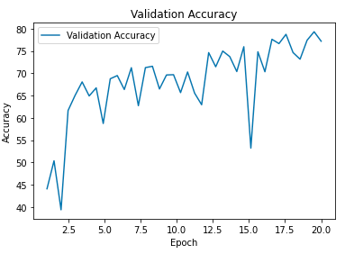

# Semantic-Segmentation-using-Unet
As a part of assignment of Machine Vision and Image processing course, a UNET Model has been trained and tested on ISPRS Postdam dataset.

Output samples

The complete data visualization, model training, model testing and inference is also available in the notebook.
### Best model performance Summary

Total training epochs : 20

Model best performance at 19th epoch

| Dataset      |      Size  |  Accuracy   |   Loss   |
|:------------:|:----------:|:-----------:| :------: |
|Training set  | 2000 Images|    80.03    |   0.59   |
|Validation set| 200 Images |    79.31    |   0.63   |
|Test set      | 200 Images |    79.99    |   0.54   |

### Training performance Curve

_The model can be further improved by training for more epochs and by changing the hyperparameters._

